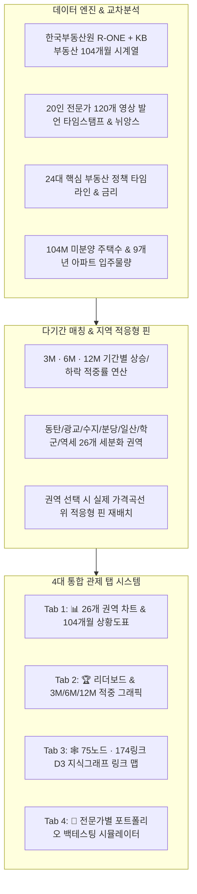

# 🏢 대한민국 부동산 전문가 예측 교차분석 & 시계열 지식그래프 종합 관제 대시보드
> **Korea Real Estate Expert Predictions Cross-Analysis & Time-Series Knowledge Graph Dashboard (2018~2026)**

[](https://jalisco00.github.io/budongsan/)
[](https://budongsan.vercel.app)
[-success?style=for-the-badge)]()

---

## 🌐 실시간 웹 접속 주소 (Live URL)

* 📊 **실시간 인터랙티브 종합 대시보드**: **[`https://jalisco00.github.io/budongsan/`](https://jalisco00.github.io/budongsan/)**
* 🕸️ **Graphify 3D 지식그래프 뷰어**: **[`https://jalisco00.github.io/budongsan/graph.html`](https://jalisco00.github.io/budongsan/graph.html)**

---

## 🚀 주요 기능 및 핵심 아키텍처



---

## 📍 26개 분석 세분화 권역

1. **🏛️ 서울 핵심 권역**: 서울 전체, 강남구, 서초구, 송파구, 마포구, 성동구, 노원구
2. **🚄 수도권 핵심 신도시 & 1기 신도시**:
   - **동탄**: 동탄1/동탄2/GTX-A 역세권 및 남사 반도체 클러스터 호재
   - **광교**: 수원 영통/광교신도시 신분당선 역세권 & 호수공원
   - **수지**: 용인 수지 풍덕천/성복/신봉 신분당선 라인
   - **분당**: 성남 분당 서현/수내 학군지 & 선도지구 재건축
   - **일산**: 고양 일산 주엽/마두/백석 1기 신도시 & GTX-A
3. **🏫 수원 세분화 (학군 / 역세)**:
   - **수원 학군지**: 영통동 학원가 / 광교 에듀타운
   - **수원 비학군지**: 권선구 / 장안구 구도심
   - **수원 역세권**: 수원역 GTX-C / 1호선 / 광교중앙역
   - **수원 비역세권**: 도보 20분 이상 외곽 주거지
4. **🌊 지방 광역시 세분화 (학군 / 역세)**:
   - **지방광역시 학군지**: 대구 수성구 범어동 / 부산 사직·남천 / 대전 둔산동
   - **지방광역시 비학군지**: 광역시 외곽 구도심
   - **지방광역시 역세권**: 도시철도 500m 이내 초역세권
   - **지방광역시 비역세권**: 대중교통 소외 외곽 & 미분양 적체 지역
   - **부산 / 대구 / 세종 / 전국**

---

## 🛠️ 기술 스택 및 무결성

* **Frontend**: HTML5, Vanilla CSS3, Vanilla JavaScript (Chart.js 4.4, D3.js v7, Vis-network)
* **Backend / Data Pipeline**: Python 3.13, SQLite (`mega_real_estate.db`, 205,000+ Records), Pandas, NumPy
* **Deployment**: GitHub Actions (`.github/workflows/deploy.yml`), GitHub Pages, Vercel

---

## 📜 로컬 실행 방법

```bash
# 1. 저장소 클론
git clone https://github.com/iverson-ko/budongsan.git
cd budongsan

# 2. 로컬 웹 서버 실행
python3 server.py

# 3. 브라우저 접속
# http://localhost:8088
```
